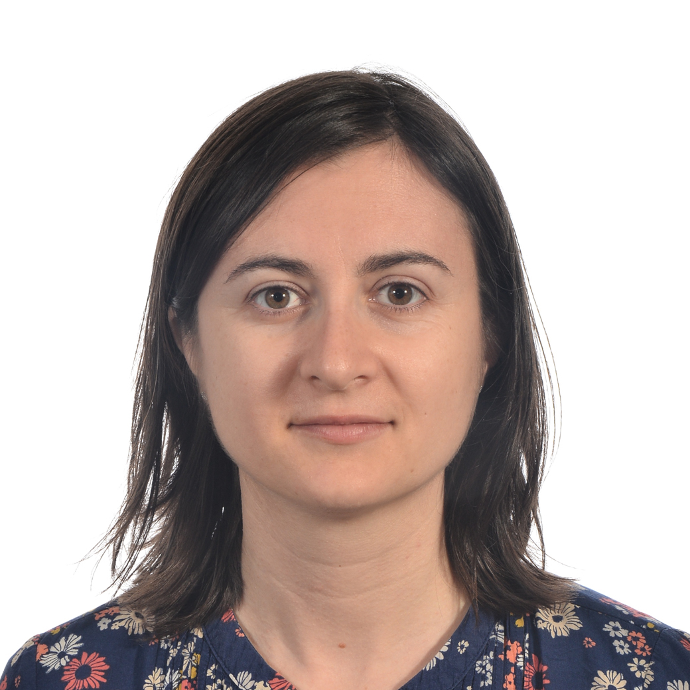

Serena Bonaretti
============================================

.. raw:: html

   <!-- when adding new pages to the toctree below, update 'navbar_links' in conf.py-->

.. toctree::
   :hidden:

   transparentResearch
   projects
   publications
   teaching
   software

|

.. raw:: html

   <!-- figures have to be in the folder _images-->

|
|
|
|
|
|
|
|
|
|
|
|
|
|
|
|

I am a researcher interested in :ref:`transparent research <transparentResearch>`, including  open data management, reproducible workflows, and interactive publications

I am specialized in image acquisition, image processing, and biomechanics to investigate aging diseases of the musculoskeletal system. See my latest release  :ref:`pyKNEEr <pykneer>`

I also enjoy teaching and all my material is freely available

|

.. raw:: html

   Complete CV:  <a href="_attachments/CV_SBonaretti.pdf" target="_blank">here</a>
   

Email: serena dot bonaretti at maastrichtuniversity dot nl

.. raw:: html

   <link rel="stylesheet" href="https://cdnjs.cloudflare.com/ajax/libs/font-awesome/4.7.0/css/font-awesome.min.css">
   <a href="https://github.com/sbonaretti" target="_blank"><i class="fa fa-github" style="font-size:21px;"></i></a>
   <a href="https://twitter.com/serenabonaretti" target="_blank"><i class="fa fa-twitter" style="font-size:21px;"></i></a>

   <a href="https://www.linkedin.com/in/serena-bonaretti-1bb9b239/" target="_blank"><i class="fa fa-linkedin" style="font-size:21px;"></i></a>

   <a itemprop="sameAs" content="https://orcid.org/0000-0003-4264-1773"
      href="https://orcid.org/0000-0003-4264-1773" target="orcid.widget" rel="noopener noreferrer" style="vertical-align:top;">orcid.org/0000-0003-4264-1773</a>

|
|
